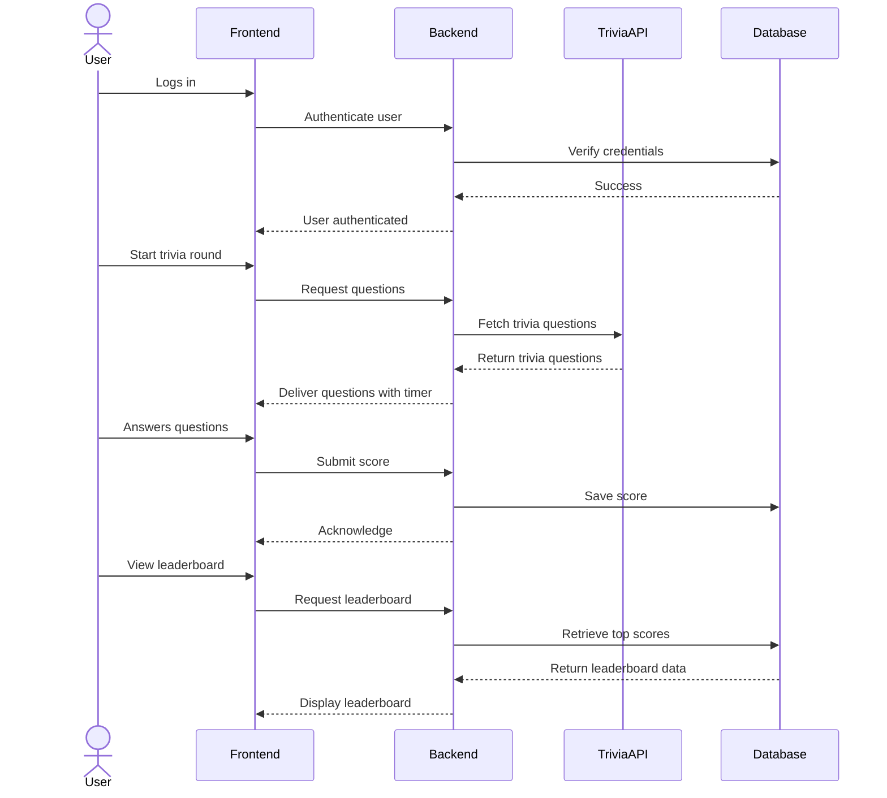

# Trivia Challenge Leaderboard

A fun web app where users compete in short trivia challenges, earn points, and climb a global leaderboard.  
A brief description of the application here. 

## 🚀 Specification Deliverable

> [!NOTE]
>  Fill in this sections as the submission artifact for this deliverable. You can refer to this [example](https://github.com/webprogramming260/startup-example/blob/main/README.md) for inspiration.

For this deliverable I did the following. I checked the box `[x]` and added a description for things I completed.

- [x] Proper use of Markdown
- [x] A concise and compelling elevator pitch
- [x] Description of key features
- [x] Description of how you will use each technology
- [x] One or more rough sketches of your application. Images must be embedded in this file using Markdown image references.

### Elevator pitch
---
Tired of mindlessly scrolling? Put your knowledge to the test! **Trivia Challenge Leaderboard** is a fast-paced quiz game where you race against the clock to answer as many questions as possible. Each correct answer earns you points, and the more you get right, the higher you climb on the global leaderboard. With fresh trivia pulled from an external API and live leaderboard updates, you’ll always have new challenges waiting for you. Can you outscore your friends and claim the top spot?

### Design
---
#### Rough sketch of app layout

- **Login/Register Page**: Users can create accounts or log in.  
- **Game Page**: Timer counts down while trivia questions appear one by one. User selects answers and earns points.  
- **Leaderboard Page**: Shows the global leaderboard, updating live whenever a player posts a new score.

### Key features
---
- User Accounts: Register, log in, and save your progress.
- Trivia Gameplay: Timed rounds with points awarded for each correct answer.
- Dynamic Questions: Pulls trivia questions from a public trivia API.
- Global Leaderboard: Ranks players by score, stored in the database.
- Live Updates: Leaderboard updates instantly via WebSocket.
- Replayability: Always fresh trivia content with multiple categories and difficulties.

### Technologies
---
I am going to use the required technologies in the following ways.

-HTML – Structure the app with semantic elements like header, footer, navigation, forms (login), and main content areas (game + leaderboard).

-CSS – Style the app with a modern look: responsive layout, colors, animations for timer countdown, and hover effects on answer buttons.

-React – Build the app using React components. Use routing for navigation (Login, Game, Leaderboard pages). Use React hooks for timer countdowns, game state, and user interactivity.

-Service (Node.js/Express) – Provide backend endpoints for:
    -Register/login/logout
    -Start trivia round (fetch questions from API)
    -Submit score
    -Get leaderboard rankings

-DB/Login (MongoDB) – Store user accounts (securely hashed passwords) and game scores. Use queries to generate leaderboard rankings.

-WebSocket – Broadcast leaderboard updates to all connected clients when a new score is submitted. Keeps the experience interactive and exciting.

## 🚀 AWS deliverable

For this deliverable I did the following. I checked the box `[x]` and added a description for things I completed.

- [x] **Server deployed and accessible with custom domain name** - [My server link](https://startup.kadenmullin.click).

## 🚀 HTML deliverable

For this deliverable I did the following. I checked the box `[x]` and added a description for things I completed.

- [x] **HTML pages** – `index.html`, `play.html`, `scores.html`  
- [x] **Proper HTML element usage** – `<header>`, `<main>`, `<footer>`, `<nav>`, `<menu>`, `<form>` across all pages
- [x] **Links** – Navigation links in `<menu>` and github link in `<footer>` on all pages
- [x] **Text** – Placeholder text on all pages  
- [x] **3rd party API placeholder** – Question text and answer buttons in `play.html`  
- [x] **Images** – Icons in `index.html`  
- [x] **Login placeholder** – Form with email/password in `index.html`  
- [x] **DB data placeholder** – Hard-coded leaderboard table in `scores.html`  
- [x] **WebSocket placeholder** –   Question text and answer buttons in `play.html` and leaderboard table in `scores.html`  

## 🚀 CSS deliverable

For this deliverable I did the following. I checked the box `[x]` and added a description for things I completed.

- [x] **Header, footer, and main content body** – Win95 style layout with beveled header, fixed footer, and padded main content  
- [x] **Navigation elements** – Win95 raised buttons with hover effects in the nav menu  
- [x] **Responsive to window resizing** – Flex and grid layouts scale content and answers with window size  
- [x] **Application elements** – Login form `index.css`, status bar and answers `play.css`, high scores table `scores.css`
- [x] **Application text content** – Win95 fonts and bold/monospace styling for score, timer, and headings  
- [x] **Application images** – Favicon and login icons styled with Win95 borders and shadows `index.css`

## 🚀 React part 1: Routing deliverable

For this deliverable I did the following. I checked the box `[x]` and added a description for things I completed.

- [x] **Bundled using Vite** - Set up and ran the project using Vite.
- [x] **Components** - Created separate React components for Login, Play, and Scores pages.
- [x] **Router** - Used React Router to switch between pages without reloading.

## 🚀 React part 2: Reactivity deliverable

For this deliverable I did the following. I checked the box `[x]` and added a description for things I completed.

- [x] **All functionality implemented or mocked out** - I implemented all pages using React, including mock database functions for questions and scores, dynamic gameplay logic, and persistent login data in localStorage.
- [x] **Hooks** - I used React useState for managing game state and useEffect for loading data, fetching questions, and handling the countdown timer and leaderboard updates.

## 🚀 Service deliverable

For this deliverable I did the following. I checked the box `[x]` and added a description for things I completed.

- [x] **Node.js/Express HTTP service** implemented 
- [x] **Static middleware for frontend** - implemented 
- [x] **Calls to third party endpoints** - implemented in `login.jsx` 
- [x] **Backend service endpoints** - implemented
- [x] **Frontend calls service endpoints** - implemented
- [x] **Supports registration, login, logout, and restricted endpoint** - implemented in `login.jsx`, `play.jsx` and `scores.jsx`

## 🚀 DB deliverable

For this deliverable I did the following. I checked the box `[x]` and added a description for things I completed.

- [ ] **Stores data in MongoDB** - I did not complete this part of the deliverable.
- [ ] **Stores credentials in MongoDB** - I did not complete this part of the deliverable.

## 🚀 WebSocket deliverable

For this deliverable I did the following. I checked the box `[x]` and added a description for things I completed.

- [ ] **Backend listens for WebSocket connection** - I did not complete this part of the deliverable.
- [ ] **Frontend makes WebSocket connection** - I did not complete this part of the deliverable.
- [ ] **Data sent over WebSocket connection** - I did not complete this part of the deliverable.
- [ ] **WebSocket data displayed** - I did not complete this part of the deliverable.
- [ ] **Application is fully functional** - I did not complete this part of the deliverable.
